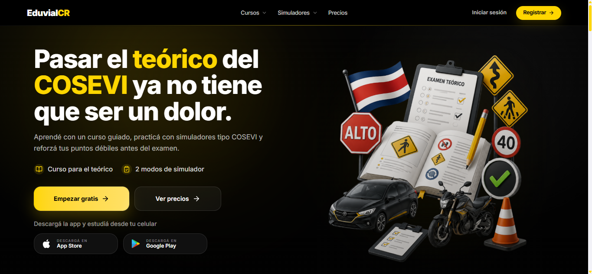
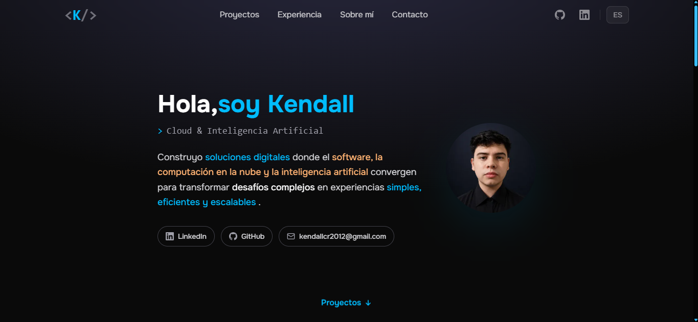
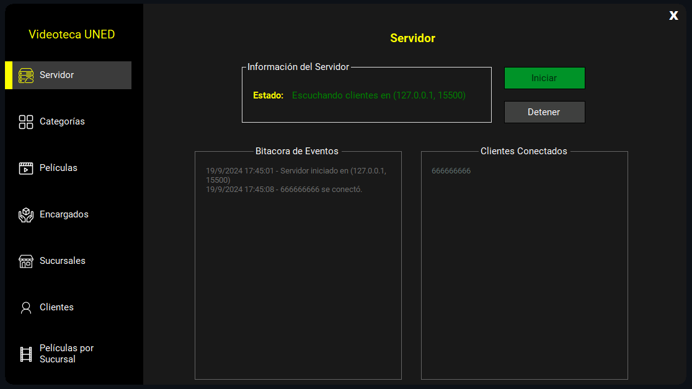

<div align="center">

# Kendall Calderón

### Software Development · Cloud Computing · Applied Artificial Intelligence

<p>
Building thoughtful digital solutions with clarity, purpose, and continuous improvement.
</p>

<p>
<a href="https://www.kendallc.dev/">
  
</a>
<a href="https://www.linkedin.com/in/kendallcal/">
  
</a>
<a href="mailto:kendallcr2012@gmail.com">
  
</a>
</p>

<p>


</p>

</div>

---

## ✦ About Me

I'm an IT professional in the final stage of my **Computer Engineering degree at UNED Costa Rica**, with my academic coursework completed and only the **Final Graduation Project** remaining.

My main interests are **software development, cloud computing, and applied artificial intelligence**.

I enjoy understanding the problem first, evaluating different approaches, and choosing the right technologies to build practical, maintainable, and well-thought-out solutions.

> **Understand the problem · Choose the right tools · Build with purpose**

---

## ✦ Featured Projects

<table width="100%">
<tr>

<td width="50%" valign="top" align="center">

### 🚦 EduvialCR



<p>


</p>

<p align="left">
EdTech platform for helping people in Costa Rica prepare for the theoretical driving exam through structured learning, quizzes, and simulations.
</p>

<p align="left">
<strong>Current stage:</strong> Frontend development in progress.
</p>

</td>

<td width="50%" valign="top" align="center">

### 🌐 Personal Portfolio

<a href="https://www.kendallc.dev/">
  
</a>

<p>


</p>

<p align="left">
My personal developer portfolio, created to present my projects, experience, technical interests, and professional profile through a clean and modern experience.
</p>

<p align="center">
<a href="https://www.kendallc.dev/">
  
</a>
<a href="https://github.com/KendallCal/portfolio">
  
</a>
</p>

</td>

</tr>
</table>

---

## ✦ Selected Projects

<table width="100%">
<tr>

<td width="33.33%" valign="top" align="center">

### 🎬 VideotecaUNED

<a href="https://github.com/KendallCal/VideotecaUNED">
  
</a>

<p>


</p>

<p align="left">
Client-server movie rental system built with <strong>C#, .NET, SQL Server, and TCP/IP</strong>.
</p>

<p align="center">
<a href="https://github.com/KendallCal/VideotecaUNED">
  
</a>
</p>

</td>

<td width="33.33%" valign="top" align="center">

### 🌳 BST Visualizer

<a href="https://github.com/KendallCal/BinarySearchTreeVisualizer">
  
</a>

<p>


</p>

<p align="left">
Interactive Java application for <strong>Binary Search Tree</strong> operations and visualization.
</p>

<p align="center">
<a href="https://github.com/KendallCal/BinarySearchTreeVisualizer">
  
</a>
</p>

</td>

<td width="33.33%" valign="top" align="center">

### ⚙️ BankerSim

<a href="https://github.com/KendallCal/BankerSim">
  
</a>

<p>


</p>

<p align="left">
Interactive implementation of the <strong>Banker’s Algorithm</strong> for safe-state analysis and deadlock avoidance.
</p>

<p align="center">
<a href="https://github.com/KendallCal/BankerSim">
  
</a>
</p>

</td>

</tr>
</table>

---

## ✦ Current Focus

```text
Currently
├── Building      → EduvialCR
├── Strengthening → Software Development
├── Exploring     → Cloud Computing
├── Applying      → Artificial Intelligence
└── Looking for   → Professional opportunities
```

---

<div align="center">

## ✦ Let's Connect

<p>
I'm open to professional opportunities, collaboration, and conversations around software, cloud, and technology.
</p>

<p>
<a href="https://www.kendallc.dev/">
  
</a>
<a href="https://www.linkedin.com/in/kendallcal/">
  
</a>
<a href="mailto:kendallcr2012@gmail.com">
  
</a>
</p>

<sub><strong>Think clearly · Build carefully · Keep improving</strong></sub>

</div>
